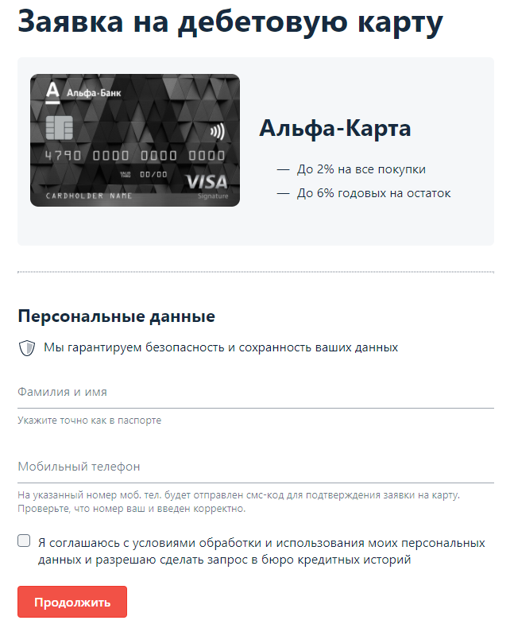
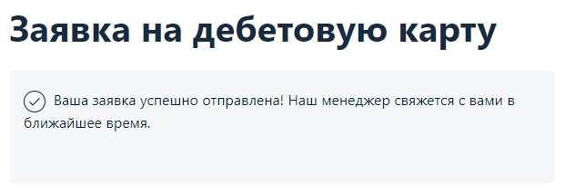

### DESCRIPTION

Необходимо автоматизировать тестирование формы заказа карты:

Требования к содержимому полей:

1. Поле Фамилия и имя - разрешены только русские буквы, дефисы и пробелы.
1. Поле телефон - только цифры (11 цифр), символ + (на первом месте).
1. Флажок согласия должен быть выставлен.  

### [TASK](https://github.com/netology-code/aqa-homeworks/tree/master/web)
* Тестируемая функциональность: отправка формы.  
* Selenide должен запускаться в headless-режиме.

Условия: если все поля заполнены корректно, то вы получаете сообщение об успешно отправленной заявке:

### LAUNCH

1. Запускаем приложение командой ``java -jar artifacts/app-order.jar``
1. Запускаем тесты ``gradlew test``
1. Доступно в браузере http://localhost:9999/

### TOOLS

CI AppVeyor  
Java, Gradle, Selenide, headless-режим
